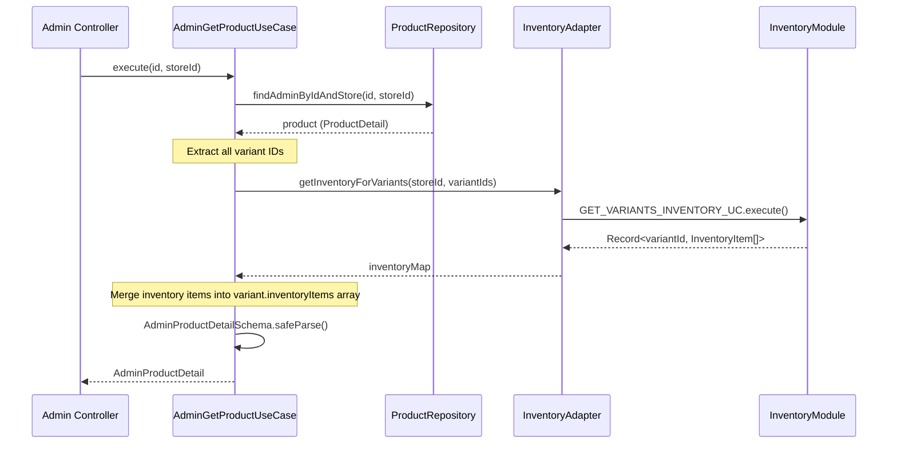
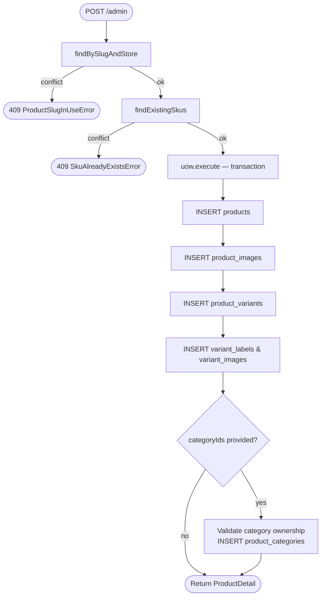
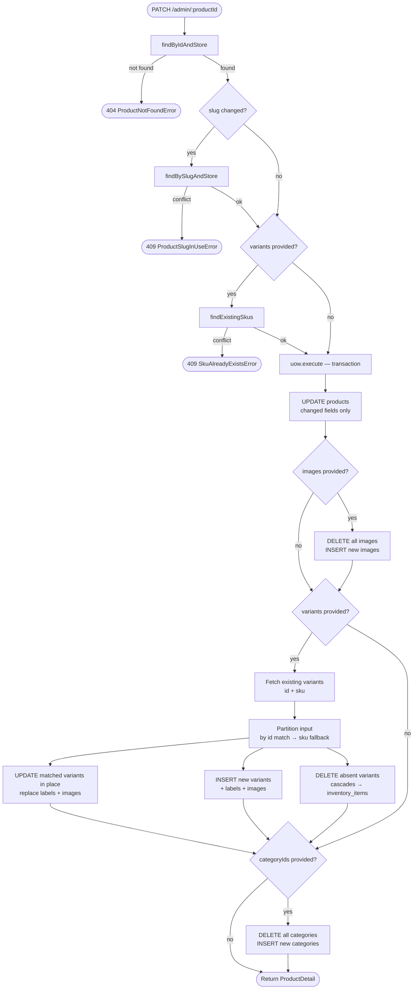
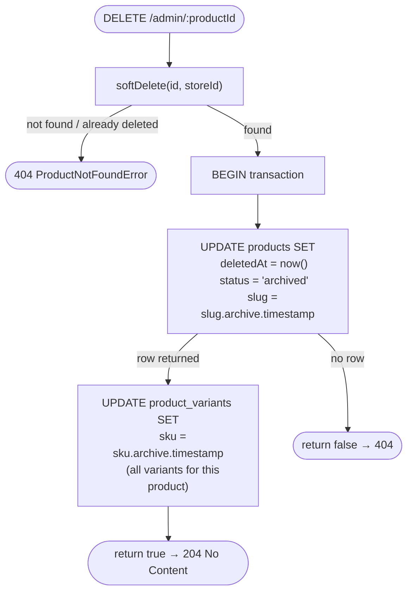

# Products Module

Handles product catalog management: creation, updates, reads, and soft deletion.

## Directory Structure

```
products/
├── domain/
│   ├── errors/              # Domain errors (not-found, slug conflict, SKU conflict)
│   └── ports/               # Repository & use-case interfaces
├── application/
│   └── use-cases/           # Orchestration: create, update, delete, get, list, get-by-slug
├── infrastructure/
│   ├── http/
│   │   ├── controllers/     # Admin + Storefront HTTP controllers
│   │   ├── dto/             # NestJS validation DTOs
│   │   └── docs/            # Swagger decorators
│   └── persistence/
│       ├── mappers/         # DB row → ProductDetail aggregate
│       └── repositories/
│           ├── drizzle-product.repository.ts
│           └── queries/     # Per-operation query functions
└── products.module.ts
```

## Cross-Module Integration

The `Products` module aggregates inventory data for its administrative views (often referred to as the "Medusa Approach" for clean module separation). 

- **Internal Port**: It defines an `IInventoryService` port within its own domain layer.
- **Adapter**: It implements an `InventoryAdapter` in the infrastructure layer that calls the `InventoryModule` to fetch stock levels.
- **Usage**: The `AdminGetProductUseCase` fetches the base product details, then uses the `IInventoryService` port to fetch `inventoryItems` for all variants, merging them into an `AdminProductDetail` object.

### Admin Get Product Aggregation Flow

The `GET /admin/:productId` endpoint orchestrates the assembly of the `AdminProductDetail` aggregate by querying the database for product data and reaching out to the inventory module.



## Domain Errors

| Error | Trigger |
|---|---|
| `ProductNotFoundError` | Product ID not found or wrong store |
| `ProductSlugInUseError` | Slug already taken within same store |
| `SkuAlreadyExistsError` | SKU globally conflicts with another product's variant |

## Controllers

Two controllers serve different audiences from the same shared use cases.

### Admin (`product.admin.controller.ts`)

- **Base path:** `stores/:storeId/products/admin`
- **Auth:** Platform realm (`@UseRealm('platform')`) + `StorePermissionGuard`
- **Permissions:** `products.read`, `products.create`, `products.update`, `products.delete`
- **Endpoints:** `GET /`, `GET /:productId`, `POST /`, `PATCH /:productId`, `DELETE /:productId`
- `GET /:productId` orchestrates `AdminGetProductUseCase` to return an `AdminProductDetail`, which includes `costPrice` on variants **and** an array of `inventoryItems` from the `Inventory` module.

### Storefront (`product.storefront.controller.ts`)

- **Base path:** `stores/:storeId/products`
- **Auth:** `@PublicRoute()` — no authentication required
- **Endpoints:** `GET /`, `GET /:productId`, `GET /slug/:slug`
- Enforces `status = 'active'` by passing `query.status = 'active'` — drafts and archived products are invisible.
- Strips `costPrice` from all variant responses via `omitCostPrice()`.

## Create Flow (`POST /admin`)

Creates a product with its images, variants (with labels/images), and category associations in a single atomic transaction.



## Update Flow (`PATCH /admin/:productId`)

The update use case applies a **partial patch** — only fields present in the request body are changed.



### Variant Identity Preservation

Variants are matched by `id` first, then by `sku` as a fallback. Matched variants are **updated in place** — their UUID is preserved, which keeps `inventory_items` FK references intact. Only variants absent from the input payload are deleted (which cascades inventory). Labels and images on surviving variants are still replaced (they are value objects with no external FK dependents).

> **Rule:** Never omit `variants` from the payload unless you want them left untouched. Sending `variants: [...]` is a declarative statement of the full desired variant set.

## Delete Flow (`DELETE /admin/:productId`)

Soft delete — the product is **never hard-deleted**.



The slug and SKU suffix appended on deletion frees the unique constraints immediately, allowing the same slug/SKU to be reused on a new product without any delay.

## Read Paths

| Context | Filter | Output Type |
|---|---|---|
| Admin `GET /:productId` | any status, not deleted | `AdminProductDetail` (includes `costPrice` & `inventoryItems`) |
| Admin `GET /` (list) | filter by status optional | `ProductDetail` (includes `costPrice`) |
| Storefront `GET /:productId` | `status = active` only | `ProductDetail` (cost stripped) |
| Storefront `GET /slug/:slug` | `status = active` only | `ProductDetail` (cost stripped) |
| Storefront `GET /` (list) | `status = active` only | `ProductDetail` (cost stripped) |

All reads are scoped to `storeId` — cross-tenant access is not possible.

## Schema Package

Input/output types live in `@ferrite/schema` (not in this module):

| Schema | Purpose |
|---|---|
| `CreateProductInput` | POST body |
| `UpdateProductInput` | PATCH body (all fields optional) |
| `UpdateVariantSchema` | Variant entry within update payload; adds optional `id` for identity matching |
| `ProductDetail` | Full aggregate response (product + images + variants + categories) |
| `AdminProductDetail` | Admin aggregate response (adds `inventoryItems` array to variants) |
